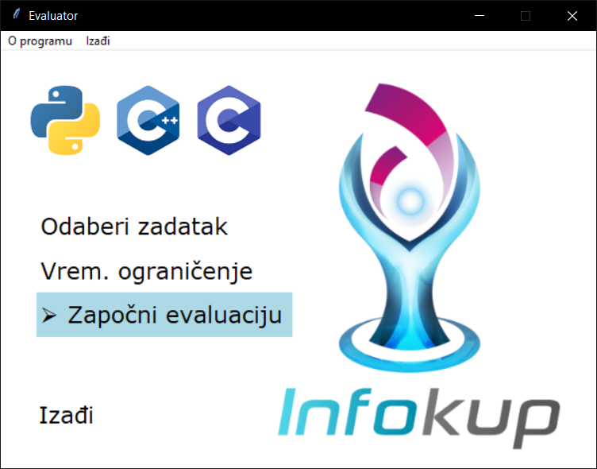
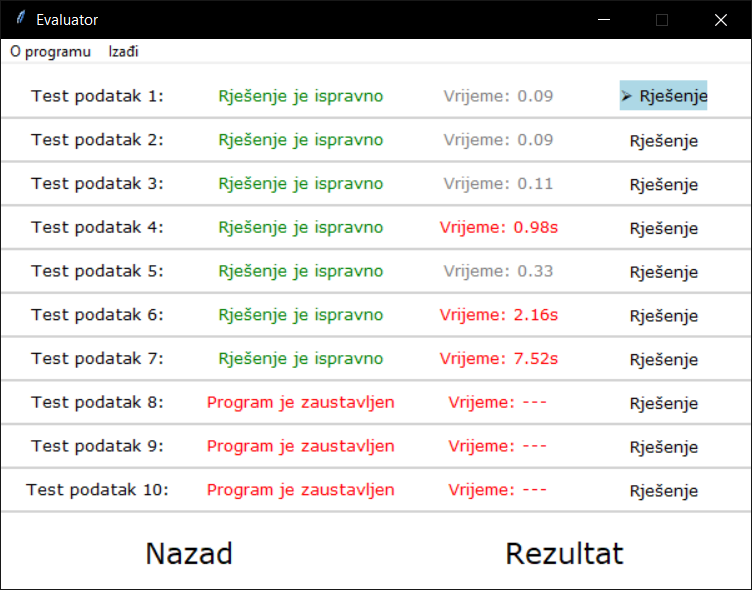
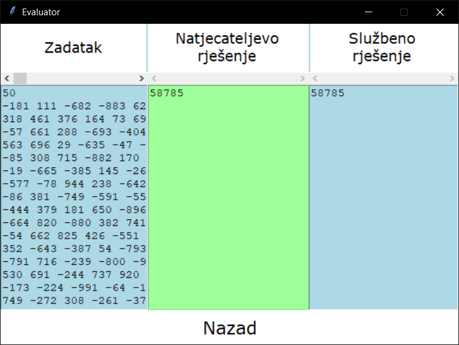

## How to use

`Evaluator.py` or the executable has to be in the same directory with solutions and the `Test` folder.
Solutions in C or C++ must be compiled to `.exe` before running the evaluator.

Copy `Evaluator.py` to example directories and run it there. 